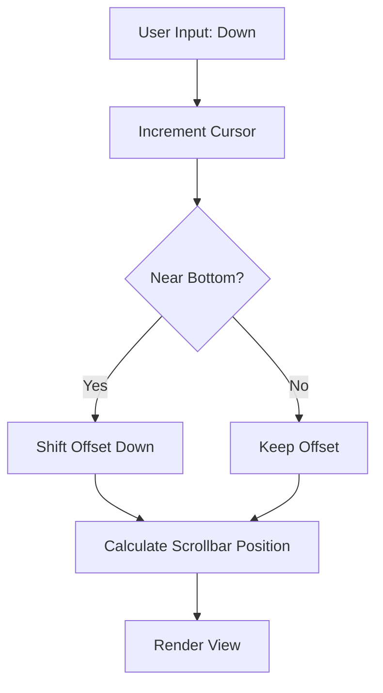

# Refactoring Plan: Enhanced Model List Scrolling & Navigation

## 1\. Executive Summary & Goals

The current scrolling implementation in the "YOUR MODELS" list is functional but lacks visual feedback and optimized boundary handling. This plan aims to refine the scrolling logic within the TUI to provide a smoother, more professional user experience.

**Key Goals:**

  * **Implement Visual Indicators:** Add scrollbars or "more items" indicators to signal content beyond the viewport.
  * **Improve Scroll Logic:** Refine the `updateOffset` mechanism to ensure the cursor remains centered or properly padded during navigation.
  * **Enhance Boundary Feedback:** Provide visual cues when the user reaches the start or end of the list.

## 2\. Current Situation Analysis

Based on `internal/ui/components/list.go`, the current system uses a basic `offset` and `visibleHeight` calculation:

  * **Hardcoded visible height:** The logic `visibleHeight := l.Height - 6` in `View` is slightly decoupled from the logic in `updateOffset`, leading to potential "jumping" or inconsistent padding.
  * **Lack of affordance:** There is no visual scrollbar or arrow indicating that more models exist above or below the current view.
  * **Strict boundary:** When hitting the top or bottom, the UI simply stops without any "bounce" or "edge" styling.

## 3\. Proposed Solution / Refactoring Strategy

### 3.1. High-Level Design / Architectural Overview

The refactor focuses on the `List` component. We will shift from a "lazy" offset update to a "padded" scrolling strategy and integrate a scrollbar generated via Lip Gloss.

### 3.2. Key Components / Modules

  * **`internal/ui/components/list.go`**: Primary logic changes for offset calculation and the addition of a `renderScrollbar` helper.
  * **`internal/ui/styles.go`**: Addition of scrollbar-specific colors and characters (e.g., `░` for track, `█` for thumb).

### 3.3. Detailed Action Plan / Phases

#### Phase 1: Scrolling Logic Refinement

**Objective:** Ensure a smoother transition when moving through the list.
**Priority:** High

  * **Task 1.1: Implement Padded Scrolling**
      * **Rationale:** Prevents the cursor from hitting the very top/bottom edge before scrolling starts, giving the user more context.
      * **Action:** Update `updateOffset` to maintain a "padding" of at least 1-2 items where possible.
      * **Deliverable:** Cursor stays 1 item away from the edge during continuous scrolling.
  * **Task 1.2: Synchronize Height Calculations**
      * **Rationale:** Eliminate magic numbers (like `-4` or `-6`) scattered across methods.
      * **Action:** Define a constant or helper method `getVisibleHeight()` that accounts for headers and separators.
      * **Deliverable:** Consistent rendering across different window sizes.

#### Phase 2: Visual Enhancements

**Objective:** Provide visual feedback for list depth.
**Priority:** Medium

  * **Task 2.1: Add Scrollbar Component**
      * **Rationale:** Standard UI pattern to show list progress.
      * **Action:** Calculate the ratio `visibleHeight / totalItems` and render a vertical bar on the right side of the list.
      * **Deliverable:** A functional scrollbar track in the sidebar.
  * **Task 2.2: Edge Indicators**
      * **Rationale:** Help user identify start/end of list.
      * **Action:** Use a subtle gradient or "↑"/"↓" arrows in the list header/footer when hidden items exist.
      * **Deliverable:** Icons appear/disappear based on `offset` position.

-----

## 4\. Key Considerations & Risk Mitigation

### 4.1. Technical Risks & Challenges

  * **Width Calculations:** Adding a scrollbar reduces the available width for model names.
      * *Mitigation:* Update the truncation logic in `List.View` to account for the width of the scrollbar (usually 1-2 characters).
  * **Performance:** Recalculating scrollbar positions on every tick.
      * *Mitigation:* Bubble Tea handles updates efficiently; since this is purely a view-side calculation based on two integers (`cursor` and `total`), the impact is negligible.

### 4.2. Dependencies

  * **Lip Gloss:** Required for rendering the vertical track and thumb styling.
  * **WindowSizeMsg:** The scrollbar must react to terminal resizing to prevent overflow.

### 4.3. Non-Functional Requirements (NFRs)

  * **Usability:** The list will feel more like a modern application and less like a static text file.
  * **Maintainability:** Centralizing the height/offset logic reduces bugs when adding new UI elements (like a search bar) later.

## 5\. Success Metrics / Validation Criteria

  * **Visual Check:** Scrollbar thumb accurately reflects the percentage of the list viewed.
  * **Functional Check:** Scrolling to the bottom of a 50-item list doesn't cause the cursor to "disappear" or the header to scroll off-screen.
  * **Responsive Check:** Resizing the terminal window preserves the correct offset and scrollbar height.

## 6\. Assumptions Made

  * The list will typically hold between 0 and 100 models (performance for 10,000+ items would require a different virtualization approach).
  * The user's terminal supports basic UTF-8 characters for the scrollbar (`█`, `░`).

-----

